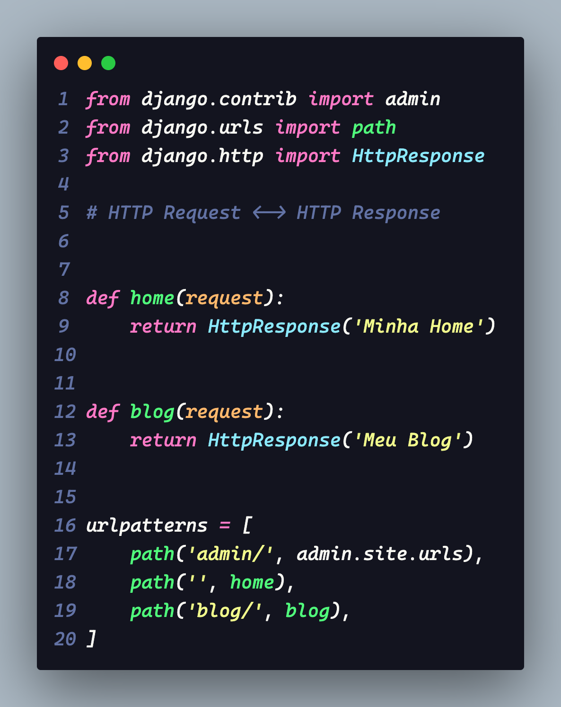

# Framework Django

Aprendizado do curso do Otávio Miranda onde aplicamos conhecimentos base em Django.

# Ambiente de Desenvolvimento

## Pyenv

Para criar um ambiente de desenvolvimento no computador devemos utilizar o Pyenv para instalar as bibliotecas necessárias para o funcionamento do projeto.

```bash
python -m venv venv
```

## Instanlando biblioteca Django

Para instalar a biblioteca Django devemos utilizar o seguinte trecho de código

```bash
pip install django
```

## Arquivo requirement.txt

Podemos salvar as informações do ambiente utilizando a função ```pip freeze``` para armazenar as bibliotecas necessárias para o projeto.

```bash
pip freeze > requeriments.txt
```

Após salvar as bibliotecas no arquivo ***requirements.txt*** podemos até apagar nossa pasta de ambiente, pois podemos instalar os pacotes necessários com a seguinte função:

```bash
pip install -r requeriments.txt
```

---

# Iniciando um projeto novo

Para iniciar um projeto novo em django devemos utilizar o seguinte código. Lembrando que o django por padrão cria uma pasta com o mesmo nome da pasta que está sendo executado com as informações dentro. Para evitar esse padrão nós vamos utilizar o "." para colocar os arquivos na raiz do projeto conforme o código abaixo:

```bash
django-admin startproject NOME_DO_PROJETO .
```

## Iniciando o Servidor Django

Para iniciar o projeto criado no servidor, devemos utilizar o arquivo ***manage.py*** que a biblioteca django criou da seguinte maneira:

```bash
python manage.py runserver
```

Isso irá abrir nosso projeto em um servidor padrão http://127.0.0.1:8000/

---
## Coração do Projeto

O django possui várias funcionalidades, além de criar a base para sua aplicação de maneira rápida. O principal arquivo que iremos alterar várias vezes durante o desenvolvimento é o arquivo contido na pasta do seu projeto principal chamado ***settings.py***. É onde estão todas as configurações da sua aplicação.

## APPS do projeto

O django basicamente é sustentado por apps, e o que são estes ***apps***? 

Os apps são estruturas que o django utiliza para manter sua aplicação em pé, ele por padrão já vem com alguns apps criados como, por exemplo, o ***admin***, ***auth***, ***contenttypes***, ***sessions***, ***messages***, ***staticfiles***.

## Middlewares

O django aceita o padrão de projeto middleware. Os middlewares são formas de você realizar tarefas no meio de outras tarefas como, por exemplo, validar um usuário para ver se ele possui permissão para acessar uma página específica.

# Primeira URL

Para esta seção é importante saber os códigos utilizados no protocolo HTTP que estão disponíveis neste site do mozila: [Códigos de status de respostas HTTP](https://developer.mozilla.org/pt-BR/docs/Web/HTTP/Status)

## Caminhos do projeto com HTTP

O django funciona com protocolos HTTP onde para toda requisição temos uma resposta. As urls utilizadas para navegação do seu site ficam na pasta principal do seu projeto. Todas as urls ficam em uma lista chamada ***urlpatterns*** onde devemos chamar a função ```path()``` e passar como argumentos para ela que são uma `string` para o caminho e uma `view` do django. Podemos verificar isso na imagem abaixo:

<div>
  
</div>

As urls não podem começar com barra "/" pois é uma boa prática e pode ocorrer erros desnecessários caso seja usado no começo. 

---

# Installed Apps

Para trabalhar em django precisamos ter ciência que ele trabalha com apps e que todos eles estão listados nos `settings` do projeto principal.

Lembrando que os apps são como "páginas" ou "views" que se comportam de maneira independente.

Quando criar um novo app?
Podemos definir a criação de novos apps de acordo com o nosso projeto, para isso precisamos responder a seguinte pergunta:
- Esses apps são relacionados?
  - Caso **sim**, devemos unificar em um app.
  - Caso contrário,devemos criar apps para cada um.
  - Um exemplo é a construção app de um e-commerce. Dentro dele existem alguns apps como página de usuário, carrinho, lista de produtos, fornecedores, compra segura. Nesse caso o indicado seria unificar essas páginas em um só app.

## Refatorando o Código Base

Para dar andamento no código, precisamos refatorar o arquivo `urls` da pasta `firs_proj`, removendo e adicionando as `views` no local correto.

***views***: devem ficar dentro dos seus apps para serem exportadas para o arquivo de url do projeto.

## Boas Práticas de Programação em Django

Sempre que criarmos um novo `app` devemos criar uma pasta chamada `templates` para colocar nosso django-html dentro, pois o framework vai procurar dentro dessa pasta utilizando a função `render()` no arquivo views do sistema.

Além disso, devemos adicionar uma camada de proteção dentro desta pasta `templates`. Isso nos força a escrever o caminho com o nome correto para o arquivo evitando o erro de renderização mais comum que ocorre no desenvolvimento em Django que é o conflito de nomes de arquivos.

```python
from django.shortcuts import render

def exemplo(request):
    return render(
      request,
      'blog/exemplo.html' # dentro da pasta template possui uma pasta blog
    )
```

# Templates e Arquivos Parciais

Com o django podemos criar arquivos parciais e templates reutilizáveis. Para isso devemos configurar o no arquivo `settings.py` do projeto principal a lista de pastas que o django vai "enxergar". Para isso basta procurar a variável `TEMPLATES` dentro deste arquivo e encontrar o item `'DIRS': []` e adicionar sua pasta que contém os arquivos reutilizáveis.

Lembrando que é preciso usar a variável `BASE_DIR` para definir o caminho da raiz do projeto e depois dela adiconar o nome da pasta: `BASE_DIR / 'PASTA_ARQUIVOS_PARCIAIS'`

```python
TEMPLATES = [
    {
        'BACKEND': 'django.template.backends.django.DjangoTemplates',
        # DIRS é a variável que você adicionará suas pastas personalizadas
        'DIRS': [
            BASE_DIR / 'base',
        ],
        'APP_DIRS': True,
        'OPTIONS': {
            'context_processors': [
                'django.template.context_processors.debug',
                'django.template.context_processors.request',
                'django.contrib.auth.context_processors.auth',
                'django.contrib.messages.context_processors.messages',
            ],
        },
    },
]
```

# PARTIALS - Arquivos Parciais do django

Os arquivos parciais, chamados de partials, são arquivos de django-html divididos em partes menores que são reutilizáveis. Podemos por exemplo criar o cabeçalho do html em um partial para reutilizá-lo em todas as páginas html que renderizarmos.

Para utilizar os arquivos parciais devemos utilizar a função `` do django no arquivo html que queremos reutilizar esse trecho de código.

# Static Files - arquivos estáticos do projeto

Para a utilização de arquivos estáticos dentro do nosso projeto como os estilos em CSS, devemos carregar o arquivo utilizando a função do django-html ``. Executando esta função, nós carregamos o app pré definido `django.contrib.staticfiles`.

Assim como os templates, o django entende as pastas `static` em cada app, tornando ele flexível onde podemos adicionar estilos ou imagens específicas para um determinado app.

## Configuração para os arquivos estáticos

Para configurar os arquivos corretamente, devemos colocar dentro do arquivo `settings.py` o diretório no qual iremos deixar os arquivos estáticos da seguinte forma:

```python
STATICFILES_DIRS = [
    BASE_DIR / 'base' / 'static'
]
```
Precisamos mostrar da onde estão sendo carregados os arquivos senão o django não irá entender onde estão e isso acarretará no conflito de arquivos do projeto.

# Context - Passando dados dinamicamente para os templates

Dentro da função `render` nós possuímos um parâmetro chamado ***context*** que podemos passar qualquer coisa que tiver chave e valor no formato de dicionário python

# URLs dinâmicas nos templates django

Para trabalhar com as URLs no django, o ideal é definir nomes para elas nas `views`, pois isso facilita na hora de fatorar o código, reduzindo os pontos de alteração para 1. Dentro da lista `urlpatterns` devemos utilizar o parâmetro `name=` para definir um nome que será passado posteriormente para o html-django de forma dinâmicas.

Outra coisa que é boa prática é definir *namespaces* para as urls utilizando a variável `app_name = NOME_DO_APP`. É importante notar que no arquivo django-html teremos que utilizar o namespace da seguinte forma para chamar a url.

Exemplo:
- namespace = blog
- como definir dentro de `view.py` -> `app_name = 'blog'`

```html
<nav>
  <ul> 
    <li>
      <a href="" >Blog</a>
    </li>
  </ul>
</nav>
```

# Estilizando a página do projeto

Para estilizar nosso projeto devemos criar um arquivo CSS e também podemos popular a página utilizando APIs como o ***jsonplaceholder***. Também é importante criar um arquivo para resetar o CSS da página para que ele fique funcional em todos os browsers, é o que chamamos de "crossbroser".

Para este projeto será utilizado o framework CSS ***Bulma***, um framework moderno que possui algumas classes prontas para uso. Para utilizar este framework devemos adicionar o seguinte trecho de código ao head do nosso HTML:

```html
<head>
  <meta charset="UTF-8">
  <meta name="viewport" content="width=device-width, initial-scale=1.0">
  <title>Project Title</title>
  <link rel="stylesheet" href="">
  <!-- Após o reset do CSS devemos adicionar o Link para o Bulma -->
  <link rel="stylesheet"
          href="https://cdn.jsdelivr.net/npm/bulma@0.9.3/css/bulma.min.css">
  <script defer src="https://use.fontawesome.com/releases/v5.0.7/js/all.js"></script>
  <link rel="stylesheet" href="">
</head>
```

# Dispondo informações dinamicamente

No django nós temos a estrutura `for in` que temos no python, para utilizar este laço de iteração dentro do arquivo django-html usando a estrutura de blocos:

```php

  

```

# Tratando Exceptions no Django

O framework possui algumas classes que nos ajudam a lidar com erros corriqueiros do dia a dia. Podemos utilizar a classe `Http404` da biblioteca `django.http` para tratar erros de páginas não existentes.

```python
from django.http import Http404

def post(request):
  ...
  if found_post is None:
    raise Http404('Página não encontrada.')
  ...
```
# Static Files no deploy da aplicação

Quando desejarmos subir a aplicação para um servidor em nuvem, devemos setar a variavel `DEBUG = False` para que o django entenda que vamos subir a aplicação. Junto dessa ação, devemos também subir os arquivos estáticos para uma pasta que o servidor consiga "ver", para isso utilizamos o comando:

```bash
python manage.py collectstatic
```

Este comando irá realizar uma varredura em todas as pastas `static` que existem em toda a aplicação django e irá fazer uma cópia dos arquivos para uma nova pasta que o desenvolvedor deseja como `static_files`.

> **ℹ️ Nota:**
> ---
> É importante criar os `namespaces` para cada static file para proteger os arquivos e evitar conflitos de nomes.

## Visualizando os estilos da aplicação com WhiteNoise

Para podermos visualizar nossa aplicação em "produção" podemos utilizar a biblioteca python `whitenoise` que serve os arquivos estáticos da pasta criada para sua aplicação.

Para isso devemos instalar o `whitenoise` com o seguinte comando:

```bash
pip install whitenoise
```

Após instalar o whitenoise devemos configurar o middleware dele no nosso arquivo `settings.py`:

```python
MIDDLEWARE = [
    'django.middleware.security.SecurityMiddleware',
    "whitenoise.middleware.WhiteNoiseMiddleware",
    # ...
  ]
```

> **ℹ️ Nota**
> ---
> O middleware do whitenoise **DEVE** ficar abaixo do midleware de segurança criado pelo django `'django.middleware.security.SecurityMiddleware'`, também deve ficar a cima dos demais midlewares conforme especificado na documentação do WhiteNoise.

Documentação WhiteNoise: [doc](https://whitenoise.readthedocs.io/en/latest/)